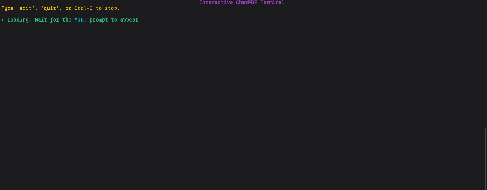
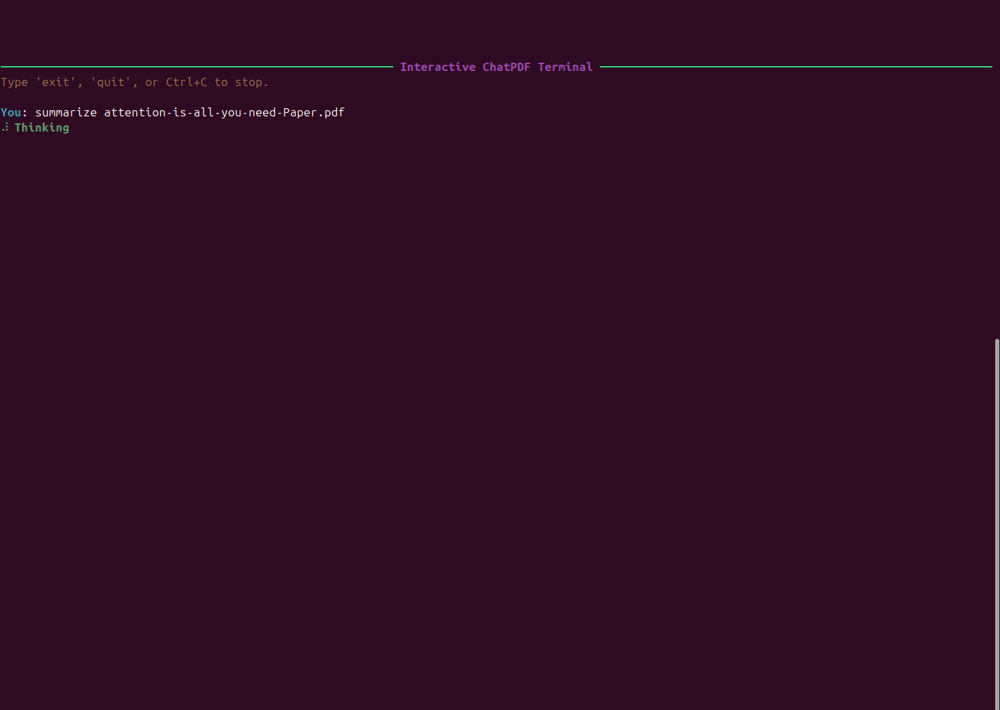
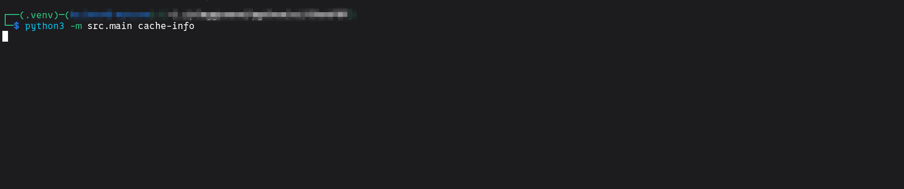
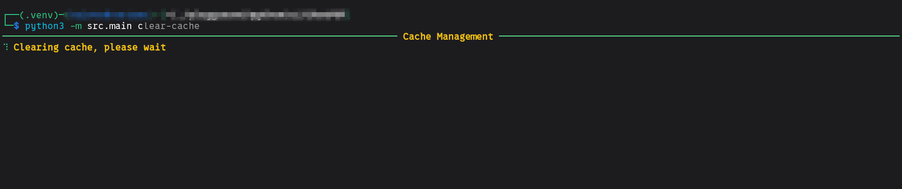

# ChatPDF

A Retrieval-Augmented Generation (RAG) system for conversational interactions with PDF documents. This system combines hybrid retrieval (lexical + semantic), reranking, and LLM integration to deliver accurate, context-grounded answers from your document collections.

## Features

- **PDF Document Processing**: Intelligent text extraction with overlapping chunk windows for context preservation
- **Hybrid Retrieval**: Combines BM25 lexical search with semantic embeddings for comprehensive document matching
- **Reranking**: Cross-encoder reranking ensures top results are contextually relevant
- **Streaming Response**: Real-time token streaming with source attribution
- **Modular Architecture**: Clean separation of concerns across ingestion, retrieval, and generation
- **Configurable**: YAML-based configuration for all parameters (models, chunk sizes, device selection, quantization)
- **Efficient**: GPU acceleration support, model quantization for resource-constrained environments, and intelligent caching

## System Architecture

```
User Query
    ↓
┌──────────────────────────────────────────────────────┐
│         DOCUMENT INGESTION PIPELINE                  │
│ PDF → Text Extraction → Chunking → Tokenization      │
│        ↓ Semantic Embeddings → Knowledge Base        │
│        ↓ BM25 Indexing → Lexical Index               │
└──────────────────────────────────────────────────────┘
    ↓
    ├─── Lexical Index (BM25 sparse vectors)
    ├─── Semantic Index (Dense embeddings)
    └─── Document Metadata & Source Mapping
    ↓
┌──────────────────────────────────────────────────────┐
│         QUERY PROCESSING PIPELINE                    │
├──────────────────────────────────────────────────────┤
│ 1. Lexical Retriever  → Top-k BM25 matches          │
│ 2. Semantic Retriever → Top-k semantic neighbors    │
│ 3. Merge & Deduplicate → Unified result set         │
│ 4. Reranker (Cross-Encoder) → Score & sort         │
│ 5. LLM Generation → Stream context-aware response   │
└──────────────────────────────────────────────────────┘
    ↓
Answer with Source Attribution & Document References
```

## Core Components

| Component | Purpose | Technology |
|-----------|---------|-----------|
| **CLI Interface** ([commands.py](src/cli/commands.py)) | User interaction & command handling | Typer + Rich |
| **RAG Orchestrator** ([rag.py](src/core/rag.py)) | Coordinates retrieval & generation pipelines | Custom integration |
| **Semantic Retriever** ([semantic_retriever.py](src/core/semantic_retriever.py)) | Dense vector retrieval | Sentence Transformers |
| **Lexical Retriever** ([lexical_retriever.py](src/core/lexical_retriever.py)) | Keyword-based search | BM25 + spaCy |
| **Reranker** ([reranker.py](src/core/reranker.py)) | Result relevance scoring | Cross-Encoder models |
| **Text Generator** ([text_generator.py](src/core/text_generator.py)) | LLM-based response generation | HuggingFace Transformers |
| **PDF Reader** ([reader.py](src/scraper/reader.py)) | Document parsing & chunking | pdfplumber, pypdf, pdfminer |
| **Knowledge Base** ([knowledge_base.py](src/core/rag_components/knowledge_base.py)) | Persistent storage of embeddings & indexes | Serialized cache |
| **Search Engine** ([search_engine.py](src/core/rag_components/search_engine.py)) | Query execution & result aggregation | Combined lexical/semantic |
| **Ingestion Pipeline** ([ingestion_pipeline.py](src/core/rag_components/ingestion_pipeline.py)) | Document processing workflow | Document → Index |

## Installation

### Prerequisites

- **Python 3.9+** - Core language runtime
- **CUDA 11.8+** (optional) - For GPU acceleration of embeddings and inference
- **~8GB RAM** minimum (16GB+ recommended with GPU)
- **Disk space** - ~5GB for model weights (varies by quantization settings)

### Quick Setup

1. **Clone and navigate to project**:
   ```bash
   git clone <repository-url>
   cd ChatPDF
   ```

2. **Create and activate virtual environment**:
   ```bash
   python -m venv venv
   source venv/bin/activate  # On Windows: venv\Scripts\activate
   ```

3. **Install Python dependencies**:
   ```bash
   pip install -r requirements.txt
   python -m spacy download en_core_web_sm
   ```

4. **Verify installation**:
   ```bash
   python -c "import torch, transformers, sentence_transformers; print('✓ All dependencies installed')"
   ```

## Configuration

The [config.yaml](config.yaml) file controls all system behavior:

### Model Configuration
```yaml
models:
  semantic_retriever: "sentence-transformers/all-MiniLM-L6-v2"  # 22M params, fast embeddings
  reranker: "cross-encoder/mmarco-mMiniLMv2-L12-H384-v1"        # Ranking model
  generator: "microsoft/Phi-3.5-mini-instruct"                   # 3.8B param LLM
```

### Retrieval Settings
```yaml
retrieval:
  chunk_size: 512           # Tokens per document chunk
  chunk_overlap: 64         # Overlap between chunks (context preservation)
  batch_size: 32            # Batch size for embedding
  top_k_lexical: 5          # BM25 results to retrieve
  top_k_semantic: 5         # Semantic results to retrieve
  rerank_top_k: 3           # Final documents for LLM context
```

### LLM Generation Settings
```yaml
llm:
  temperature: 0.7          # Creativity (0=deterministic, 1=random)
  max_tokens: 500           # Max response length
  top_p: 0.9                # Nucleus sampling
  attn_implementation: "eager"  # Attention: "eager", "sdpa", or "flash_attention_2"
  quantize:
    enable: true            # 4-bit quantization for efficiency
    how_many_bits: 4        # 4-bit or 8-bit quantization
  device: "cuda"            # "cuda" for GPU, "cpu" for CPU
```

### Caching
```yaml
cache:
  directory: ".chatpdf_cache"      # Where to store embeddings & indexes
  use_embeddings_cache: true       # Reuse embeddings on restart
  auto_invalidate: true            # Auto-clear stale cache
```

## CLI Commands

| Command | Description |
|---------|-------------|
| `python -m src.main ingest <path>` | Ingest PDF documents from a directory |
| `python -m src.main chat` | Start interactive chat session |
| `python -m src.main cache-info` | Display cache statistics and file list |
| `python -m src.main clear-cache` | Clear all cached embeddings and indexes |

## Quick Start

### 1. Ingest Documents

Prepare a directory with PDF files, then run:

```bash
python -m src.main ingest ./pdfs
```

This will:
- 📂 Scan directory for all PDF files
- 📄 Extract text using PDF parsing libraries
- ✂️ Create overlapping chunks (configurable size & overlap)
- 🔢 Generate semantic embeddings for chunks
- 🏷️ Build BM25 lexical index with tokenization
- 💾 Cache embeddings and indexes in `.chatpdf_cache/`

Example output:


### 2. Interactive Chat

Start a chat session:

```bash
python -m src.main chat
```

Then interact naturally:



Exit with `exit`, `quit`, or `Ctrl+C`.

### 3. Document Summarization

During a chat session, you can request a full document summary:



The summarization feature:
- Extracts all chunks from the specified PDF
- Uses a dedicated summarization prompt for comprehensive coverage
- Provides structured output with key sections highlighted

### 4. Cache Management

View cache information:

```bash
python -m src.main cache-info
```

Output:


Clear all cached data:

```bash
python -m src.main clear-cache
```
Output:


## How It Works

### Document Processing Pipeline

```
PDF Input
    ↓
┌─────────────────────────────────────────┐
│ 1. Text Extraction                      │
│    Multiple PDF libraries for           │
│    robustness (pdfplumber, pypdf)       │
└─────────────────────────────────────────┘
    ↓
┌─────────────────────────────────────────┐
│ 2. Intelligent Chunking                 │
│    - Configurable chunk size            │
│    - Overlapping windows preserve       │
│      context at boundaries              │
│    - Token-based splitting              │
└─────────────────────────────────────────┘
    ↓
┌─────────────────────────────────────────┐
│ 3. Tokenization                         │
│    - spaCy NLP processing               │
│    - Lemmatization for normalization    │
│    - Token counting with tiktoken       │
└─────────────────────────────────────────┘
    ↓
┌─────────────────────────────────────────┐
│ 4. Dual Indexing                        │
│    ├─ Semantic: Dense embeddings        │
│    │  (Sentence Transformers)           │
│    └─ Lexical: BM25 sparse vectors      │
│       (Rank-bm25)                       │
└─────────────────────────────────────────┘
```

### Query Processing Pipeline

```
User Query
    ↓
┌─────────────────────────────────────────┐
│ 1. Lexical Retrieval                    │
│    BM25 scoring → Top-5 matches         │
└─────────────────────────────────────────┘
    ↓
┌─────────────────────────────────────────┐
│ 2. Semantic Retrieval                   │
│    Embedding similarity → Top-5 matches │
└─────────────────────────────────────────┘
    ↓
┌─────────────────────────────────────────┐
│ 3. Result Merging                       │
│    Deduplicate & combine results        │
└─────────────────────────────────────────┘
    ↓
┌─────────────────────────────────────────┐
│ 4. Reranking                            │
│    Cross-encoder scores relevance       │
│    → Select Top-3 for context           │
└─────────────────────────────────────────┘
    ↓
┌─────────────────────────────────────────┐
│ 5. LLM Generation                       │
│    Feed context + query to LLM          │
│    Stream response tokens               │
│    Include source attribution           │
└─────────────────────────────────────────┘
```

## Project Structure

```
ChatPDF/
├── README.md                          # This file
├── config.yaml                        # System configuration
├── requirements.txt                   # Python dependencies
├── pdfs/                              # Directory for PDF documents
│
├── src/
│   ├── main.py                        # Application entry point
│   │
│   ├── cli/
│   │   ├── __init__.py
│   │   └── commands.py                # CLI interface (ingest, chat)
│   │
│   ├── core/
│   │   ├── __init__.py
│   │   ├── rag.py                     # RAG orchestrator
│   │   ├── lexical_retriever.py       # BM25 retrieval
│   │   ├── semantic_retriever.py      # Dense vector retrieval
│   │   ├── reranker.py                # Cross-encoder reranking
│   │   ├── text_generator.py          # LLM response generation
│   │   │
│   │   └── rag_components/
│   │       ├── __init__.py
│   │       ├── ingestion_pipeline.py  # Document processing
│   │       ├── knowledge_base.py      # Embeddings & indexes storage
│   │       └── search_engine.py       # Query execution
│   │
│   ├── scraper/
│   │   ├── __init__.py
│   │   └── reader.py                  # PDF text extraction
│   │
│   ├── utils/
│   │   ├── __init__.py
│   │   ├── config.py                  # YAML config loader
│   │   ├── logger.py                  # Logging utilities
│   │   ├── cli_utils.py               # CLI formatting & streaming
│   │   ├── lexical_utils.py           # NLP utilities (lemmatization)
│   │   ├── generator_utils.py         # LLM utilities
│   │   ├── prompt_utils.py            # Prompt templates
│   │   └── serializer.py              # Cache serialization
│   │
│   └── scripts/
│       ├── __init__.py
│       ├── evaluate_ragas.py          # RAGAS evaluation framework
│       └── calculate_scores.py        # Score calculation utilities
│
└── .chatpdf_cache/                    # Auto-generated embeddings cache
```


## Dependencies

The project uses carefully selected libraries for robustness and performance:

### Core ML & NLP
| Package | Purpose |
|---------|---------|
| `torch` | Deep learning framework for embeddings & LLM |
| `transformers` | HuggingFace models (reranker, LLM) |
| `sentence-transformers` | Semantic embeddings |
| `rank-bm25` | BM25 lexical retrieval |
| `spacy` | NLP tokenization and lemmatization |

### PDF Processing
| Package | Purpose |
|---------|---------|
| `pypdf` | PDF parsing|


### System & Utilities
| Package | Purpose |
|---------|---------|
| `typer` | Modern CLI framework |
| `rich` | Beautiful terminal output |
| `pydantic` | Data validation |
| `PyYAML` | Configuration parsing |
| `tiktoken` | Token counting for OpenAI models |
| `bitsandbytes` | 4-bit model quantization |
| `accelerate` | Efficient model loading |

### Evaluation
| Package | Purpose |
|---------|---------|
| `ragas` | RAG evaluation framework |
| `datasets` | HuggingFace datasets for benchmarking |
| `langchain-community` | LLM integrations for evaluation |

## Performance Optimization

### GPU Acceleration
Enable GPU processing in `config.yaml` for ~10-100x speedup:
```yaml
biencoder:
  device: "cuda"  # Use GPU for embeddings
llm:
  device: "cuda"  # Use GPU for inference
reranker:
  device: "cuda"  # Use GPU for reranking
```

### Model Quantization
Reduce memory footprint with 4-bit quantization:
```yaml
llm:
  quantize:
    enable: true
    how_many_bits: 4  # Reduces 13GB model to ~3GB
```

### Caching
Embeddings are cached automatically in `.chatpdf_cache/`:
- Ingestion only runs once
- Restart immediately loads cached embeddings
- Auto-invalidation clears stale cache

### Batch Processing
Optimize embedding generation:
```yaml
retrieval:
  batch_size: 32  # Process 32 chunks at once
                  # Increase for GPUs, decrease if OOM
```

## Usage Examples

### Example 1: Ingest HR Documentation
```bash
python -m src.main ingest ./docs/hr_policies/
```

### Example 2: Query with Follow-ups
```bash
$ python -m src.main chat
Interactive ChatPDF Terminal
Type 'exit', 'quit', or Ctrl+C to stop.

You: What are the vacation policies?
AI: According to the HR handbook, vacation policies include...
    Sources: hr_handbook.pdf (chunks 12, 45)

You: What about sick days?
AI: Sick day policies are outlined in...
    Sources: hr_handbook.pdf (chunks 18)
```

### Example 3: Large Document Collection
For processing 100+ PDFs:
1. Place all PDFs in a directory: `./large_corpus/`
2. Ingest: `python -m src.main ingest ./large_corpus/`
3. First run takes time (generates embeddings for all chunks)
4. Subsequent runs load from cache instantly
5. Chat will be responsive even with 1000+ chunks

## Troubleshooting

| Issue | Solution |
|-------|----------|
| **"No module named 'rank_bm25'"** | `pip install rank-bm25` |
| **"Error loading spacy model"** | `python -m spacy download en_core_web_sm` |
| **CUDA out of memory (OOM)** | Reduce `batch_size` in config.yaml or set `device: cpu` |
| **Slow semantic retrieval** | Enable GPU acceleration: set `device: cuda` in config.yaml |
| **Large ingestion time** | Check GPU is being used; CPU embedding generation is slow |
| **Cache not loading** | Delete `.chatpdf_cache/` and re-ingest documents |
| **LLM taking too long** | Use quantization (`quantize.enable: true`) to reduce model size |
| **Stale embeddings after deleting PDF** | `auto_invalidate: true` (default) now properly detects deleted files |

### Cache Invalidation Details

The `cache.auto_invalidate` option controls cache validation behavior:

```yaml
cache:
  auto_invalidate: true  # ✅ Recommended: Detect file deletions
```

**With `auto_invalidate: true` (strict mode)**:
- ✅ Detects when PDFs are deleted from the directory
- ✅ Automatically triggers full reindex when deletions detected
- ✅ Processes only new/changed files incrementally
- ✅ Ensures cache integrity and prevents stale embeddings

**With `auto_invalidate: false` (trust cache mode)**:
- ✅ Trusts existing cache without validation
- ✅ Only processes newly added files
- ❌ Does NOT detect deleted files (use with caution)
- ⏱️ Faster startup but risks stale data

**Recommendation**: Keep `auto_invalidate: true` (default) for data integrity.

## Evaluation

The project includes RAGAS (Retrieval-Augmented Generation Assessment) integration for evaluating RAG pipeline quality:

### Metrics Evaluated

| Metric | Description |
|--------|-------------|
| **Faithfulness** | Measures if the answer is grounded in the retrieved context |
| **Answer Relevancy** | Evaluates how relevant the answer is to the question |
| **Context Precision** | Checks if retrieved context contains relevant information |
| **Context Recall** | Measures coverage of ground truth in retrieved context |

### Running Evaluation

```bash
# Evaluate using the Qasper dataset
python -m src.scripts.evaluate_ragas

# Calculate scores from evaluated results
python -m src.scripts.calculate_scores
```

Results are saved to `evaluated.csv` and `graded.csv` for analysis.

## Advanced Configuration

### Tuning Retrieval
```yaml
retrieval:
  # More chunks = better coverage, slower reranking
  top_k_lexical: 10      # Retrieve more BM25 results
  top_k_semantic: 10     # Retrieve more semantic results
  rerank_top_k: 5        # Keep top 5 for LLM context
```

### Changing Models
```yaml
models:
  # Use larger, more accurate models (requires more VRAM)
  semantic_retriever: "sentence-transformers/all-mpnet-base-v2"
  reranker: "cross-encoder/mmarco-ColBERTv2"
  generator: "mistral-7b"  # Requires 16GB+ VRAM
```

### Custom Chunk Sizes
```yaml
retrieval:
  chunk_size: 256        # Smaller chunks = more granular, slower
  chunk_size: 1024       # Larger chunks = broader context
  chunk_overlap: 128     # Increase for boundary sensitivity
```

## Architecture Deep Dive

### Hybrid Retrieval Strategy

**Why both BM25 and semantic search?**

- **BM25 (Lexical)**: Perfect for exact keywords, acronyms, and proper nouns
  - Example: "What is the AI strategy?" → Finds documents with keyword "AI"
  
- **Semantic**: Understands intent and paraphrasing
  - Example: "What's the artificial intelligence plan?" → Finds same documents despite different wording

- **Combined**: Cover both exact matches and conceptual matches
  - Results are merged and deduplicated before reranking

### Reranking Pipeline

Cross-encoder models are expensive but extremely accurate:
1. Lexical retriever: 5 results (fast)
2. Semantic retriever: 5 results (fast)
3. Merge & deduplicate: ~8 unique results
4. Reranker: Score all 8 (expensive but thorough)
5. LLM gets: Top 3 highest-scoring results (cost-efficient)

This balance minimizes latency while maximizing answer quality.

### Knowledge Base Management

The knowledge base stores:
- **Chunk embeddings**: Dense vectors for semantic search
- **BM25 index**: Term frequencies and IDF scores
- **Document metadata**: Filenames, chunk positions, original text
- **Tokenizer state**: For consistent chunk splitting

All data is serialized to `.chatpdf_cache/` for persistence.

## License

MIT License - See LICENSE file for details

## Support

- 📖 Check [config.yaml](config.yaml) for detailed configuration options
- 🔧 Review [src/core/rag.py](src/core/rag.py) for RAG pipeline implementation
- 🐛 See **Troubleshooting** section above for common issues
- 💬 Open an issue for bugs or feature requests

---